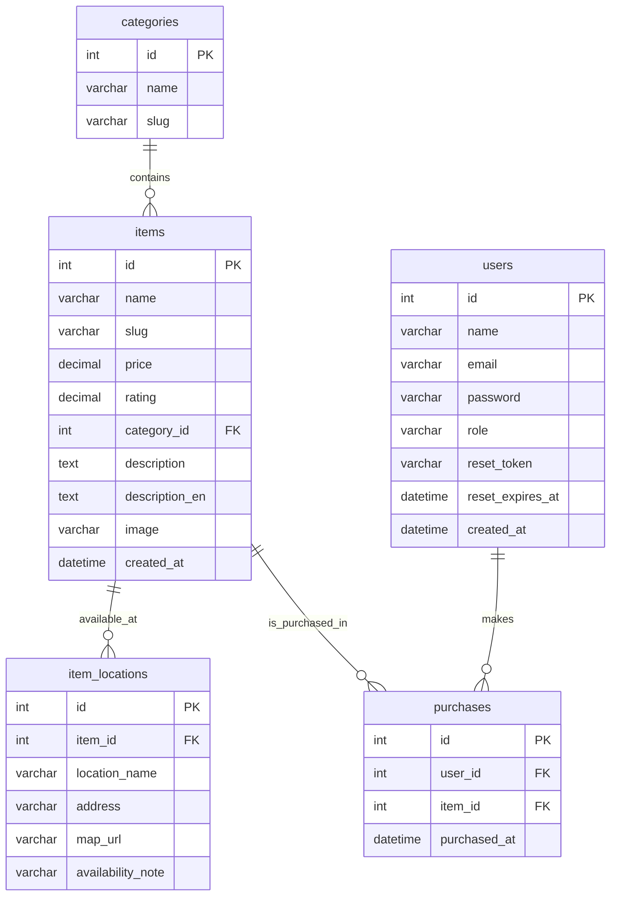

# RysuReads Technical Requirements Evidence

This document collects short code excerpts and implementation notes that can be reused in the final project report.

The goal is not to repeat the full source code, but to provide precise evidence that each technical requirement is implemented in the repository.

## Table of Contents

1. [Visual Design System](#visual-design-system)
2. [Layout and Structure](#layout-and-structure)
3. [Responsive Design](#responsive-design)
4. [Products / Items Page](#products--items-page)
5. [Search Function With AJAX](#search-function-with-ajax)
6. [Categories and Breadcrumbs](#categories-and-breadcrumbs)
7. [Store Locations and Maps](#store-locations-and-maps)
8. [User Authentication System](#user-authentication-system)
9. [SEO Implementation](#seo-implementation)
10. [Database Requirements](#database-requirements)
11. [Implementation Notes for the Report](#implementation-notes-for-the-report)

## Visual Design System

### Font System

The project uses two Google Fonts, loaded globally in the shared page wrapper:

```php
<link href="https://fonts.googleapis.com/css2?family=Cormorant+Garamond:wght@400;500;600;700&family=Inter:wght@400;500;600;700;800&display=swap" rel="stylesheet">
```

The body text and interface chrome use `Inter`, while headings and key navigation text use `Cormorant Garamond`:

```css
body {
    font-family: 'Inter', sans-serif;
}

h1, h2, h3, h4, .brand-name, .hero-copy h1, .detail-copy h1, .section-heading h2, .page-heading-row h1 {
    font-family: 'Cormorant Garamond', Georgia, serif;
}

.primary-nav a,
.nav-tab {
    font-family: 'Cormorant Garamond', Georgia, serif;
}
```

### Color Palette

The UI uses a warm editorial palette. The main design tokens are declared in `:root`:

| Token | Value | Use |
| --- | --- | --- |
| `--bg` | `#f7f1e8` | Base background tone |
| `--surface` | `#fcf8f2` | Card and sheet background |
| `--surface-strong` | `#ffffff` | Strong surface color |
| `--text` | `#1b1516` | Primary text |
| `--muted` | `#645a58` | Secondary text |
| `--brand` | `#7a1f2b` | Main brand accent |
| `--brand-dark` | `#54151d` | Dark brand accent |
| `--brand-soft` | `#f2e5e7` | Soft brand background |
| `--accent` | `#a94551` | Hover and highlight accent |
| `--accent-soft` | `#f6ecec` | Soft accent background |
| `--border` | `rgba(27, 21, 22, 0.1)` | Borders and separators |

The body background is layered with gradients:

```css
body {
    background:
        radial-gradient(circle at 10% 0%, rgba(122, 31, 43, 0.10), transparent 22%),
        radial-gradient(circle at 88% 12%, rgba(169, 69, 81, 0.08), transparent 20%),
        linear-gradient(180deg, #f8f2ea 0%, #f3ece3 100%);
}
```

## Layout and Structure

### Shared Page Wrapper

The layout is centralized in `page_open.php` and `page_close.php`:

```php
<!DOCTYPE html>
<html lang="en" data-theme="light" data-lang="en">
<head>
    <meta charset="UTF-8">
    <meta name="viewport" content="width=device-width, initial-scale=1.0">
    <meta name="description" content="<?php echo e($metaDescription); ?>">
    <title><?php echo e($pageTitle); ?> | RysuReads</title>
    <link href="https://fonts.googleapis.com/css2?family=Cormorant+Garamond:wght@400;500;600;700&family=Inter:wght@400;500;600;700;800&display=swap" rel="stylesheet">
    <link href="https://cdn.jsdelivr.net/npm/bootstrap@5.3.0/dist/css/bootstrap.min.css" rel="stylesheet">
    <style><?php echo file_get_contents(__DIR__ . '/../public/css/style.css'); ?></style>
</head>
<body class="<?php echo e($bodyClass); ?>">
<?php include __DIR__ . '/header.php'; ?>
<main class="main-content">
```

```php
</main>
<?php include __DIR__ . '/footer.php'; ?>
<?php include __DIR__ . '/mobile_drawer.php'; ?>
<script><?php echo file_get_contents(__DIR__ . '/../public/js/script.js'); ?></script>
</body>
</html>
```

### Header

The header places the logo on the left and navigation on the right:

```php
<header class="site-header sticky-top">
    <div class="header-shell container">
        <div class="header-row">
            <a class="brand-lockup" href="/" aria-label="RysuReads home">
                " alt="RysuReads logo" class="brand-mark">
                <span class="brand-tagline-only">Read More. Grow More.</span>
            </a>

            <div class="header-right">
                <div class="header-utility-top">
                    <a href="/login" data-i18n="header.login">Login</a>
                    <a href="/register" data-i18n="header.register">Register</a>
                </div>
                <div class="header-nav-row">
                    <nav class="primary-nav" aria-label="Primary navigation">
                        <button class="nav-tab" type="button" data-nav-toggle="nav-home" data-i18n="nav.home">Home</button>
                        <button class="nav-tab" type="button" data-nav-toggle="nav-browse" data-i18n="nav.products">Products</button>
                        <button class="nav-tab" type="button" data-nav-toggle="nav-search" data-i18n="nav.search">Search</button>
                        <button class="nav-tab" type="button" data-nav-toggle="nav-contact" data-i18n="nav.contact">Contact</button>
                    </nav>
                </div>
            </div>
        </div>
    </div>
</header>
```

### Footer

The footer contains short site information and quick links:

```php
<footer class="site-footer mt-5">
    <div class="container py-4 footer-shell">
        <div>
            <p class="footer-brand">RysuReads</p>
            <p class="footer-copy" data-i18n="footer.copy">Copyright 2026</p>
        </div>
        <div class="footer-links">
            <a class="footer-link" href="/products" data-i18n="footer.products">Products</a>
            <a class="footer-link" href="/search" data-i18n="footer.search">Search</a>
            <a class="footer-link" href="/public/sitemap.xml" data-i18n="footer.sitemap">Sitemap</a>
        </div>
    </div>
</footer>
```

### Main Content Width

The page width is flexible because the app uses Bootstrap containers and a flex column body:

```css
body {
    display: flex;
    flex-direction: column;
    min-height: 100vh;
}

.main-content {
    flex: 1;
}

.hero-grid {
    display: grid;
    grid-template-columns: minmax(0, 1.2fr) minmax(320px, 0.8fr);
}
```

The report can explain this as a fluid layout with centered content containers, flexible grids, and responsive breakpoints rather than a fixed-width page.

## Responsive Design

The project is responsive through custom media queries and mobile-specific UI elements:

```css
@media (max-width: 991.98px) {
    .hero-grid,
    .detail-layout {
        grid-template-columns: 1fr;
    }

    .nav-drawer {
        width: min(92vw, 520px);
    }
}

@media (max-width: 767.98px) {
    .header-utility-top {
        display: none;
    }

    .header-right {
        display: none;
    }

    .mobile-header-right {
        display: flex;
    }

    .nav-drawer {
        width: 100vw;
        padding: 0;
    }
}
```

The mobile drawer is implemented separately:

```css
.mobile-drawer {
    position: fixed;
    inset: 0;
    width: 100vw;
    height: 100%;
    transform: translateX(100%);
    pointer-events: none;
}

.mobile-drawer.is-open {
    transform: translateX(0);
    pointer-events: all;
}
```

## Products / Items Page

### Sorting and Pagination

The products page loads catalog data from MySQL and supports sorting plus pagination:

```php
$sortKey = $_GET['sort'] ?? 'newest';
$sortOptions = allowed_sort_options();
$sortSql = $sortOptions[$sortKey] ?? $sortOptions['newest'];
$page = max(1, (int) ($_GET['page'] ?? 1));
$perPage = 6;
$offset = ($page - 1) * $perPage;
```

```php
function allowed_sort_options(): array
{
    return [
        'newest' => 'items.created_at DESC',
        'name_asc' => 'items.name ASC',
        'name_desc' => 'items.name DESC',
        'price_asc' => 'items.price ASC',
        'price_desc' => 'items.price DESC',
        'rating_desc' => 'items.rating DESC',
    ];
}
```

```php
$sql = "SELECT items.*, categories.name AS category_name, categories.slug AS category_slug
        FROM items
        INNER JOIN categories ON categories.id = items.category_id
        ORDER BY $sortSql
        LIMIT ? OFFSET ?";
```

### Catalog Rendering

```php
<article class="product-card">
    " alt="<?php echo e($item['name']); ?>" class="product-image">
    <div class="product-card-body">
        <div class="product-meta">
            <a class="chip" href="<?php echo e(category_url($item['category_slug'])); ?>"><?php echo e($item['category_name']); ?></a>
            <span class="rating">&#9733; <?php echo number_format((float) $item['rating'], 1); ?></span>
        </div>
        <h3><?php echo e($item['name']); ?></h3>
    </div>
</article>
```

The report can state that pagination was chosen instead of lazy loading because the project is server-rendered, lightweight, and easier to verify in a lab environment.

## Search Function With AJAX

### Search Page

The search page is a dedicated route with a live input field:

```php
<input type="text" id="searchInput" class="form-control form-control-lg" placeholder="Type a product name, category, or keyword" data-i18n-placeholder="search.placeholder" data-ajax-search>
<div id="searchResults" class="search-results-grid" aria-live="polite"></div>
```

### AJAX Behavior

```js
function setupAjaxSearch() {
    var input = document.querySelector('[data-ajax-search]');
    var results = document.getElementById('searchResults');
    if (!input || !results) return;

    var debounceTimer = null;

    function runSearch() {
        var keyword = input.value.trim();
        results.innerHTML = '<div class="loading-state">Searching...</div>';

        fetch('/search-items?q=' + encodeURIComponent(keyword))
            .then(function (response) { return response.text(); })
            .then(function (html) {
                results.innerHTML = html || renderEmpty('No matching items found.');
            });
    }

    input.addEventListener('input', function () {
        window.clearTimeout(debounceTimer);
        debounceTimer = window.setTimeout(runSearch, 250);
    });
}
```

### Search Endpoint

```php
$sql = "SELECT items.*, categories.name AS category_name, categories.slug AS category_slug
        FROM items
        JOIN categories ON categories.id = items.category_id
        WHERE items.name LIKE ? OR items.description LIKE ? OR categories.name LIKE ?
        ORDER BY $sortSql
        LIMIT 12";
```

```php
<span class="item-desc-en"><?php echo e(mb_strimwidth(search_preview_text($item['description_en'] ?? null, (string) $item['description'], 'Description unavailable in English.'), 0, 110, '...')); ?></span>
<span class="item-desc-zh" hidden><?php echo e(mb_strimwidth((string) $item['description'], 0, 110, '...')); ?></span>
```

This satisfies the AJAX requirement because results update dynamically while typing and the page does not reload during search.

## Categories and Breadcrumbs

Categories are loaded from the database and shown in the products page:

```php
$categories = $conn->query("SELECT id, name, slug FROM categories ORDER BY name");
```

Breadcrumbs appear on relevant pages:

```php
<nav aria-label="breadcrumb">
    <ol class="breadcrumb custom-breadcrumb">
        <li class="breadcrumb-item"><a href="/">Home</a></li>
        <li class="breadcrumb-item"><a href="/products">Products</a></li>
        <li class="breadcrumb-item"><a href="<?php echo e(category_url($item['category_slug'])); ?>"><?php echo e($item['category_name']); ?></a></li>
        <li class="breadcrumb-item active" aria-current="page"><?php echo e($item['name']); ?></li>
    </ol>
</nav>
```

This creates the required navigation path structure such as `Home > Products > Category > Item`.

## Store Locations and Maps

Store locations are stored in the database and displayed on the item detail page:

```php
$locationsStmt = $conn->prepare('SELECT location_name, address, map_url, availability_note FROM item_locations WHERE item_id = ? ORDER BY location_name');
```

```php
<article class="location-card">
    <h3><?php echo e($location['location_name']); ?></h3>
    <p><?php echo e($location['address']); ?></p>
    <p class="muted-line"><?php echo e($location['availability_note'] ?: 'Available'); ?></p>
    <a href="<?php echo e($location['map_url']); ?>" target="_blank" rel="noopener" class="btn-link-action">Open Google Maps</a>
</article>
```

The SQL seed file also stores multiple locations per item:

```sql
CREATE TABLE IF NOT EXISTS item_locations (
    id INT AUTO_INCREMENT PRIMARY KEY,
    item_id INT NOT NULL,
    location_name VARCHAR(150) NOT NULL,
    address VARCHAR(255) NOT NULL,
    map_url VARCHAR(255) NOT NULL,
    availability_note VARCHAR(255) DEFAULT NULL,
    FOREIGN KEY (item_id) REFERENCES items(id) ON DELETE CASCADE ON UPDATE CASCADE
);
```

## User Authentication System

### Login

```php
$stmt = $conn->prepare('SELECT id, name, email, password, role FROM users WHERE email = ? LIMIT 1');
$stmt->bind_param('s', $email);
$stmt->execute();
$user = $stmt->get_result()->fetch_assoc();

if ($user && password_verify($password, $user['password'])) {
    session_regenerate_id(true);
    $_SESSION['user'] = [
        'id' => $user['id'],
        'name' => $user['name'],
        'email' => $user['email'],
        'role' => $user['role'] ?: 'user',
    ];
}
```

### Register

```php
if ($name === '' || !filter_var($email, FILTER_VALIDATE_EMAIL) || strlen($password) < 8) {
    app_flash('error', 'Enter a name, valid email, and password with at least 8 characters.');
}

$hash = password_hash($password, PASSWORD_DEFAULT);
$stmt = $conn->prepare('INSERT INTO users (name, email, password, role) VALUES (?, ?, ?, ?)');
```

### Forgot Password

```php
$token = bin2hex(random_bytes(16));
$expires = date('Y-m-d H:i:s', time() + 3600);
$update = $conn->prepare('UPDATE users SET reset_token = ?, reset_expires_at = ? WHERE id = ?');
```

### Reset Password

```php
$stmt = $conn->prepare('SELECT id FROM users WHERE reset_token = ? AND reset_expires_at > NOW() LIMIT 1');
$hash = password_hash($password, PASSWORD_DEFAULT);
$update = $conn->prepare('UPDATE users SET password = ?, reset_token = NULL, reset_expires_at = NULL WHERE reset_token = ?');
```

### Logout

The app exposes a logout route through the front controller:

```php
if ($path === '/logout') {
    require_once '../pages/logout.php';
    exit;
}
```

### Buy Item and My Books

```php
require_login();
$stmt = $conn->prepare('INSERT IGNORE INTO purchases (user_id, item_id) VALUES (?, ?)');
```

```php
$stmt = $conn->prepare("
    SELECT items.*, categories.name AS category_name, categories.slug AS category_slug,
           purchases.purchased_at
    FROM purchases
    JOIN items ON items.id = purchases.item_id
    JOIN categories ON categories.id = items.category_id
    WHERE purchases.user_id = ?
    ORDER BY purchases.purchased_at DESC
");
```

The authentication system satisfies the requirement for email and password login, validation, hashed passwords, register, login, logout, and forgot password.

## SEO Implementation

### Meta Titles and Descriptions

Every page receives a meaningful title and description through the shared page wrapper:

```php
$pageTitle = $pageTitle ?? 'RysuReads';
$metaDescription = $metaDescription ?? 'RysuReads online catalog for books and items.';
```

```php
<meta name="description" content="<?php echo e($metaDescription); ?>">
<title><?php echo e($pageTitle); ?> | RysuReads</title>
```

### Semantic HTML

The app uses semantic elements such as `header`, `nav`, `main`, `section`, `article`, `footer`, and breadcrumb navigation.

### Friendly URLs

The front controller routes clean paths such as:

```php
if ($path === '/products') {
    require_once '../pages/items.php';
    exit;
}

if (preg_match('#^/products/([^/]+)$#', $path, $matches)) {
    $_GET['slug'] = urldecode($matches[1]);
    require_once '../pages/item_details.php';
    exit;
}
```

### Sitemap and Robots

```xml
<urlset xmlns="http://www.sitemaps.org/schemas/sitemap/0.9">
    <url>
        <loc>http://localhost:8080/</loc>
    </url>
    <url>
        <loc>http://localhost:8080/products</loc>
    </url>
</urlset>
```

```txt
User-agent: *
Allow: /

Sitemap: sitemap.xml
```

The app therefore applies more than three SEO practices: meaningful titles, meta descriptions, semantic HTML, friendly URLs, sitemap, and robots file.

## Database Requirements

The database definition includes the required entities and relationships:

```sql
CREATE TABLE IF NOT EXISTS users (
    id INT AUTO_INCREMENT PRIMARY KEY,
    name VARCHAR(150) NOT NULL,
    email VARCHAR(150) NOT NULL UNIQUE,
    password VARCHAR(255) NOT NULL,
    reset_token VARCHAR(100) DEFAULT NULL,
    reset_expires_at DATETIME DEFAULT NULL,
    created_at DATETIME NOT NULL DEFAULT CURRENT_TIMESTAMP
);

CREATE TABLE IF NOT EXISTS categories (
    id INT AUTO_INCREMENT PRIMARY KEY,
    name VARCHAR(100) NOT NULL UNIQUE,
    slug VARCHAR(120) NOT NULL UNIQUE
);

CREATE TABLE IF NOT EXISTS items (
    id INT AUTO_INCREMENT PRIMARY KEY,
    name VARCHAR(150) NOT NULL,
    slug VARCHAR(180) NOT NULL UNIQUE,
    price DECIMAL(10,2) NOT NULL,
    rating DECIMAL(3,1) NOT NULL DEFAULT 4.5,
    category_id INT NOT NULL,
    description TEXT NOT NULL,
    image VARCHAR(255) DEFAULT NULL,
    created_at DATETIME NOT NULL DEFAULT CURRENT_TIMESTAMP,
    FOREIGN KEY (category_id) REFERENCES categories(id) ON DELETE RESTRICT ON UPDATE CASCADE
);
```

The runtime bootstrap also ensures the schema exists:

```php
function ensure_schema(mysqli $conn): void
{
    $conn->exec("CREATE TABLE IF NOT EXISTS categories (...)");
    $conn->exec("CREATE TABLE IF NOT EXISTS items (...)");
    $conn->exec("CREATE TABLE IF NOT EXISTS item_locations (...)");
    $conn->exec("CREATE TABLE IF NOT EXISTS users (...)");
    $conn->exec("CREATE TABLE IF NOT EXISTS purchases (...)");
}
```

The sample data is inserted automatically:

```php
seed_catalog_data($conn);
```

## ER Diagram

The ER diagram below matches the current codebase and database behavior. It includes the runtime fields that are used by the application even when they are added through schema bootstrap rather than the initial SQL file.

### Entities and Attributes

#### users

- `id` PK
- `name`
- `email`
- `password`
- `role`
- `reset_token`
- `reset_expires_at`
- `created_at`

#### categories

- `id` PK
- `name`
- `slug`

#### items

- `id` PK
- `name`
- `slug`
- `price`
- `rating`
- `category_id` FK
- `description`
- `description_en`
- `image`
- `created_at`

#### item_locations

- `id` PK
- `item_id` FK
- `location_name`
- `address`
- `map_url`
- `availability_note`

#### purchases

- `id` PK
- `user_id` FK
- `item_id` FK
- `purchased_at`

### Relationships

- `categories (1) -> (many) items`
- `items (1) -> (many) item_locations`
- `users (1) -> (many) purchases`
- `items (1) -> (many) purchases`
- `users (many) -> (many) items` through `purchases`

### Correct Mermaid Definition

Use this ERD structure if you want to redraw the diagram manually or regenerate it in Mermaid:



### How to Explain the Diagram in the Report

- `categories` groups items into catalog sections.
- `items` is the central catalog table.
- `item_locations` stores multiple physical branches or availability points for each item.
- `users` stores account data and password reset state.
- `purchases` connects users and items so the system can track which user bought which item.
- `description_en` is stored because the site supports bilingual content and the English preview is used when the UI language is English.
- `role` is stored because the authentication system distinguishes normal users from admins.

## Implementation Notes for the Report

Suggested wording for the report:

- The layout uses a shared wrapper so the header, footer, and scripts are consistent across the site.
- The design is built around a flexible container-based structure, not a fixed-width layout.
- Desktop navigation uses dropdown-style panels, while mobile navigation uses a full-screen drawer.
- The catalog page uses server-side pagination because it keeps rendering simple and avoids unnecessary client-side complexity.
- Search uses AJAX so results update while typing without a full page reload.
- Categories and breadcrumbs make the browsing path explicit and improve navigation clarity.
- Store locations are linked to item records so each item can list multiple branches with Google Maps links.
- Authentication uses email/password with validation, hashing, and password reset tokens.
- SEO is covered through titles, descriptions, semantic HTML, clean routes, sitemap, and robots file.

### Most Relevant File References

- `components/header.php`
- `components/footer.php`
- `components/page_open.php`
- `components/page_close.php`
- `public/css/style.css`
- `public/js/script.js`
- `public/index.php`
- `config/app.php`
- `config/database.php`
- `config/init.sql`
- `pages/items.php`
- `pages/search.php`
- `pages/search_items.php`
- `pages/item_details.php`
- `pages/login.php`
- `pages/register.php`
- `pages/forgot_password.php`
- `pages/reset_password.php`
- `pages/buy_item.php`
- `pages/my_books.php`
- `docs/er_diagram.mmd`
